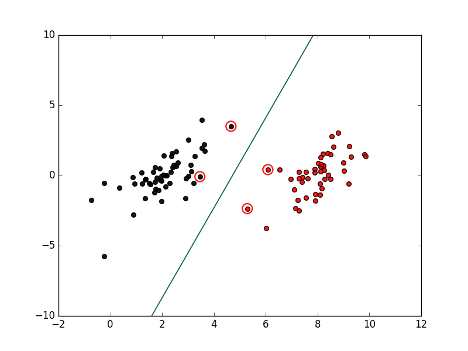

# 基于简单SMO最优化算法实现的SVM分类器
## 文件说明
* **loadData.py:** 载入数据，将数据转换成分类器需要的格式，并且可以完善了画图函数，可以直观地显示数据点的分布情况
* **result_img.png:** 结果图像
* **svm_simple.py:** 该函数实现了一个基于简单SMO最优化算法的SVM分类器，并且添加了实时显示分割面的功能函数，更加直观地了解分割面的变化过程
* **testSet.txt:** 测试数据文件

## 运行结果图像
